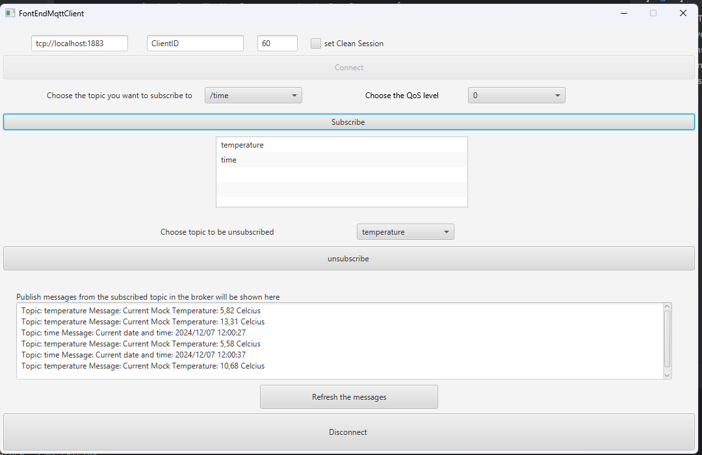

# CombinedToTProtocols_MQTTAndCoAP
A project about combining Internet of THings Protocols CoAP and MQTT through a gateway. 

## How to run this code
- step 1: run the CoAPServer file in "src/main/java/com/combinediot/revisitiot/sensorProgram/CoAPServerAPP.java"
- step 2: run the MQTTBroker file in "src/main/java/com/combinediot/revisitiot/GatewayProgram/MQTTbroker/MQTTBroker.java"
- step 3: run the Gateway file in "src/main/java/com/combinediot/revisitiot/GatewayProgram/Gateway/GatewayProg.java"
- step 4: write "mvn clean javafx:run" on the project terminal for see the javafx interface

## Image of the JavaFX interface result

## Process
1. Connect to the broker by writing url "tcp://localhost:1883" and Clientid 
2. If connected then you can subscribe to the two resources time and temperature(is a mock temperature)
3. remove the subscribtion if you want
4. disconnect the client from the broker 
5. close the window/terminal by clicking X at the top-right side